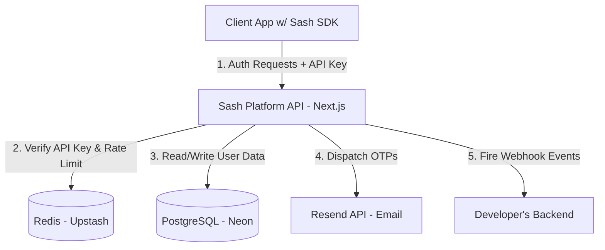

# System Architecture & Design

This document provides a deep dive into the technical architecture, data flows, and design decisions behind **Sash**, a production-ready "Auth-as-a-Service" platform.

---

## 🏗️ High-Level System Architecture

Sash operates as a **Multi-Tenant Monorepo** (using Turborepo) comprising three main domains:
1. **The API & Platform (`apps/web`)**: Next.js App Router application managing the Developer Dashboard and exposing the end-user API endpoints.
2. **The SDK (`packages/sdk`)**: A strictly-typed React SDK containing headless hooks and pre-built UI components.
3. **The Consumer (`apps/demo-client`)**: A Vite-based client demonstrating the integration.



---

## 🔐 Security & Multi-Tenancy

### 1. Multi-Tenant Isolation
Sash serves authentication for *other developers' applications*. Every incoming API request from an SDK contains an `Authorization: Bearer sash_live_<random>` header.
- The `projectId` is derived from this key via a fast database lookup.
- **Data Isolation:** All database queries regarding end-users utilize compound keys `@@unique([email, projectId])`. This ensures that `user@example.com` can independently sign up for Application A and Application B without their data crossing over.

### 2. Comprehensive Security Posture
- **Input Validation:** 100% of API endpoints use rigorous `zod` schema parsing. Requests failing validation instantly return standard `422 Unprocessable Entity` responses.
- **Burner Email Protection:** The signup route automatically validates incoming emails against a dataset of 3,500+ disposable/burner domains, blocking spam at the gate.
- **User Enumeration Protection:** The `forgot-password` route returns a generic success message and processes in relatively uniform time, preventing attackers from probing for registered emails.
- **HTTP Security Headers:** Next.js middleware forcefully injects `Strict-Transport-Security`, `X-Frame-Options`, `X-Content-Type-Options`, and strict `Content-Security-Policy` headers.
- **CORS Management:** Dynamic CORS origins are validated against the `ALLOWED_ORIGIN` environment variable.

---

## ⚡ Ephemeral State & Redis (Upstash)

Rather than polluting the PostgreSQL database with short-lived tokens and sessions, Sash relies heavily on **Upstash Serverless Redis** for high-performance ephemeral state management.

### Rate Limiting
- **Pattern:** Fixed Window Counter.
- **Implementation:** `redis.incr(key)` and `redis.expire(key, 60)`.
- **Usage:** Limits sign-up and login attempts to 10 requests per minute per IP to thwart brute-force credential stuffing.

### One-Time Passwords (OTPs)
- **Flow:** When a user requires verification, a 6-digit random code is generated.
- **Storage:** Stored in Redis as `otp:<type>:<projectId>:<email>` with a strict 10-minute TTL (`EX 600`).
- **Security:** Redis atomicity guarantees that OTPs are single-use. Verification attempts are tracked in a parallel Redis key `otp_attempts:...`. If a user fails 5 times, the OTP is destroyed instantly to prevent offline brute-forcing.

### Session Management
- **Flow:** Successful logins generate a cryptographically random session ID.
- **Storage:** Stored in Redis mapped to the user's ID.
- **Transport:** Delivered to the client exclusively via `HttpOnly`, `Secure`, `SameSite=Lax` cookies. The SDK never holds the session token in JavaScript memory, neutralizing XSS exfiltration risks.

---

## 📦 The React SDK (`@septic/sdk`)

The SDK is compiled using `tsup` targeting both ESM and CJS.

### Architecture
- **API Client Layer (`client.ts`):** A zero-dependency `fetch` wrapper that handles JSON parsing and standardizes API errors into a custom `SashApiError` class.
- **Context Provider (`context.tsx`):** A React Context that wraps the application. On mount, it attempts to restore the session by aggressively fetching the `/me` endpoint. It memoizes auth methods to prevent unnecessary re-renders.
- **Drop-in UI Components (`SignIn.tsx`, `SignUp.tsx`, `ForgotPassword.tsx`):** Pre-built interfaces utilizing complex local state (e.g., auto-advancing 6-digit OTP input refs).

### Vanilla CSS Styling System
A critical design decision was made to **avoid TailwindCSS** for the SDK components. 
- Using Tailwind inside an NPM package often causes class-name collisions or requires complex consumer-side PostCSS configurations.
- Instead, the SDK uses **Vanilla CSS with CSS Variables** (`var(--sash-brand)`).
- `tsup` is configured with `--injectStyle`, meaning the CSS is automatically bundled and injected into the DOM when the component is mounted. This provides a flawless Developer Experience (DX) — the developer just imports the component, and it looks beautiful out of the box.

---

## 🪝 Event-Driven Webhooks

Sash is designed to act as an external authentication provider. Developers need to know when a user signs up so they can synchronize their local database (e.g., creating a user profile).

- **Implementation:** Background asynchronous webhook dispatching via `fetch`.
- **Security (HMAC):** Every payload is strungify'd and hashed using `crypto.createHmac("sha256", secret)` against the developer's Webhook Secret.
- **Transport:** The resulting hash is attached to the `X-Sash-Signature` header, allowing the consuming developer to mathematically prove the event came from Sash.

---

## 🗄️ Database Schema Summary (Prisma)

```prisma
model ProjectOwner {
  // Developers using the Sash Dashboard
  id           String    @id
  email        String    @unique
  passwordHash String
  projects     Project[] // One-to-Many
}

model Project {
  // A unique application (Tenant)
  id         String   @id
  apiKey     String   @unique // sash_live_...
  webhookUrl String?
  ownerId    String
  users      User[]   // One-to-Many
}

model User {
  // End-users scoped to a Project
  id            String    @id
  email         String
  passwordHash  String
  projectId     String
  emailVerified Boolean   @default(false)
  isActive      Boolean   @default(true) // For Dashboard Suspensions

  @@unique([email, projectId]) // Crucial multi-tenancy constraint
}
```
